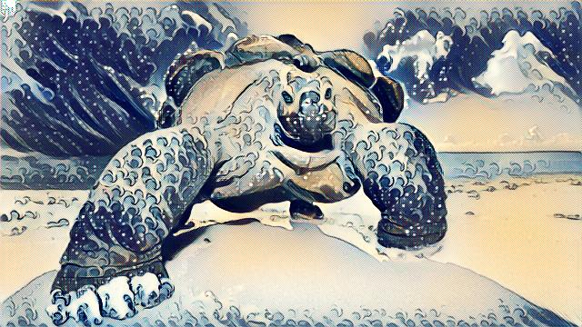
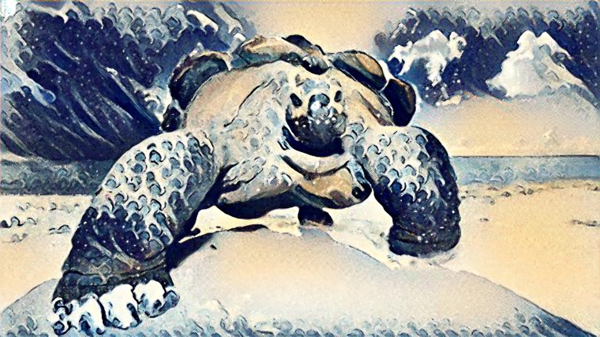
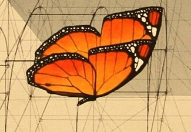
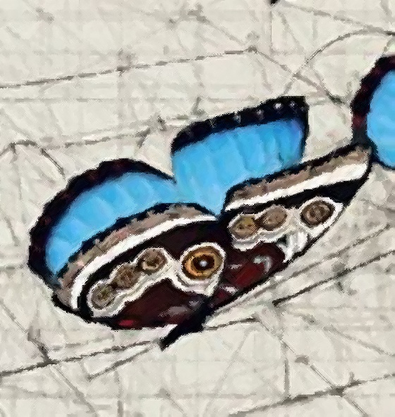
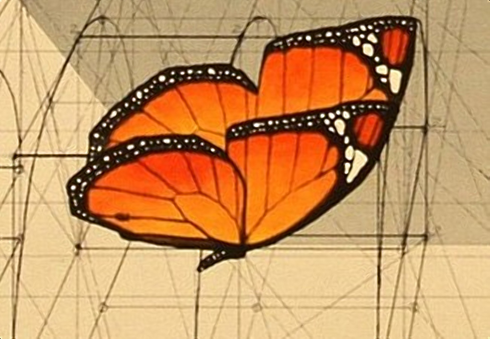

# Artistic Super Resolution Imaging Algorithms
==============================================

This repo is a library of state-of-the-art fast Super Resolution Imaging.


## Artistic Angle Maps
Angle Maps Based Interpolation plus Artistic loss of information. This algorithm has particuar impressive renders with result images of Justin Johnson's fast algorithm for neural style transfer (https://github.com/jcjohnson/fast-neural-style). This is the interpolation behind this video https://www.youtube.com/watch?v=pJ5RgsPEYgM 




## Angle Maps
Angle Maps Based Interpolation




## DCCI
Inspired by Directional Cubic Convolution Interpolation




### Installation

1 Download the repository :
```
$ git clone https://github.com/alexis-jacq/image_scaling.git
```

2 The library uses a standard ``CMake`` workflow:
```
$ mkdir build && cd build
$ cmake ..
$ make
```

### Usage

Artistic Angle Maps:
```
$ ./artisticAM picture_name scaled_picture_name
```
Angle Maps:
```
$ ./AM picture_name scaled_picture_name
```
DCCI:
```
$ ./DCCI picture_name scaled_picture_name
```

